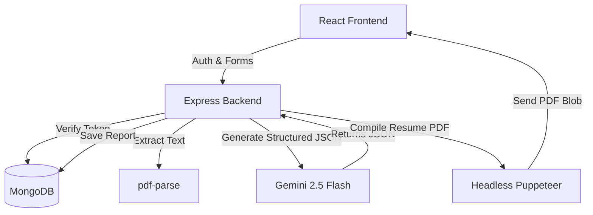

# Resume.ai

A full-stack web application that uses Google Gemini to build custom interview preparation plans and generate tailored, job-specific resumes.

By analyzing a target job description against your resume (parsed from an uploaded PDF) or a manual self-description, Resume.ai builds a structured 7-day study roadmap, flags potential interview questions with model answers, lists skill gaps, and generates a print-ready tailored resume PDF.

---

## Features

- **Authentication**: JWT-based session management stored in secure HttpOnly cookies, with password hashing via Bcrypt and a token blacklist on logout.
- **PDF Text Parsing**: Server-side text extraction from uploaded PDF resumes.
- **Interview Prep**: Generates 5+ technical questions and 3+ behavioral questions matching the job description, including the interviewer's intent and suggested answers.
- **Skill Gap Analysis**: Flags missing skills from the job description and ranks them by severity (low, medium, high).
- **7-Day Roadmap**: A daily checklist with focus areas tailored to bridge your skill gaps.
- **Resume Tailoring**: Generates an HTML resume tailored to the target job and compiles it into a downloadable PDF using Puppeteer.

---

## Tech Stack



### Frontend
- **React 19** with **Vite**
- **React Router 7** for routing and protected routes
- **Sass (SCSS)** for custom modular layouts
- **Context API** for auth state and interview reports state
- **Axios** with credentials enabled for session cookies

### Backend
- **Node.js** & **Express**
- **MongoDB** & **Mongoose**
- **Google GenAI SDK** (`@google/genai`) using the `gemini-2.5-flash` model
- **Puppeteer** for HTML-to-PDF rendering
- **Multer** for handling resume uploads in memory
- **pdf-parse** for binary text extraction

---

## Directory Structure

```
Re-asume-Ai/
├── Backend/                    # Express API
│   ├── src/
│   │   ├── config/             # DB connection configuration
│   │   ├── controllers/        # Route controllers (auth & interview reports)
│   │   ├── middlewares/        # Auth validation & file upload filters
│   │   ├── models/             # Mongoose schemas (User, Blacklist, InterviewReport)
│   │   ├── routes/             # API endpoints
│   │   ├── services/           # Gemini API calls & Puppeteer PDF rendering
│   │   └── app.js              # Express app setup
│   ├── .env                    # Local environment variables
│   ├── server.js               # App entry point
│   └── package.json
│
├── Frontend/                   # React SPA
│   ├── src/
│   │   ├── features/
│   │   │   ├── auth/           # Login, Register, Protected routes, Auth Context
│   │   │   └── interview/      # Dashboard, Reports, Timeline details
│   │   ├── style/              # Global SCSS files
│   │   ├── App.jsx             # React entry layout & Providers
│   │   ├── app.routes.jsx      # React Router config
│   │   ├── main.jsx            # Mounting script
│   │   └── style.scss          # Primary stylesheet
│   ├── package.json
│   └── vite.config.js
```

---

## Database Schema

### User Schema
Stores credential details for registered users.
- `username`: String (Unique, Required)
- `email`: String (Unique, Required)
- `password`: Hashed String (Required)

### Blacklist Schema
Invalidates JWT tokens immediately upon user logout.
- `token`: String (Required, expires via MongoDB index TTL)

### InterviewReport Schema
Saves generated preparation plans for user dashboards.
- `title`: Job Title (Required)
- `jobDescription`: Target requirements (Required)
- `resume`: Text parsed from PDF
- `selfDescription`: Alternative manual description
- `matchScore`: Integer (0 to 100)
- `technicalQuestions`: Array of `{ question, intention, answer }`
- `behavioralQuestions`: Array of `{ question, intention, answer }`
- `skillGaps`: Array of `{ skill, severity: 'low' | 'medium' | 'high' }`
- `preparationPlan`: 7-day array of `{ day, focus, tasks }`
- `user`: Reference to User ObjectId

---

## API Endpoints

| Method | Endpoint | Auth Required | Description |
|:---|:---|:---|:---|
| **POST** | `/api/auth/register` | No | Creates a new user account |
| **POST** | `/api/auth/login` | No | Authenticates user and sets HttpOnly JWT cookie |
| **POST** | `/api/auth/logout` | No | Clears user cookie and blacklists token |
| **GET** | `/api/auth/get-me` | Yes | Retrieves user info from active session |
| **POST** | `/api/interview/` | Yes | Uploads resume and generates interview report |
| **GET** | `/api/interview/` | Yes | Fetches all interview reports for the current user |
| **GET** | `/api/interview/report/:interviewId` | Yes | Fetches a specific interview report by ID |
| **POST** | `/api/interview/resume/pdf/:interviewReportId` | Yes | Compiles and downloads the tailored resume PDF |

---

## Installation & Setup

### Prerequisites
- Node.js (v18+)
- MongoDB connection (local database or Atlas cluster)
- Google Gemini API Key

### 1. Configure Backend environment
Create a `.env` file inside the `Backend` directory:
```env
PORT=3000
MONGODB_URL=your_mongodb_connection_string
JWT_SECRET=your_jwt_signature_secret_string
GOOGLE_GENAI_API_KEY=your_gemini_api_key

# For production deployment:
NODE_ENV=production
FRONTEND_URL=https://your-frontend-domain.com
```

### 2. Start the Backend API
```bash
cd Backend
npm install
npm run dev # or 'npm start' in production
```
The backend server will run at `http://localhost:3000`.

### 3. Start the Frontend Client
Create a `.env` file inside the `Frontend` directory (only needed in production):
```env
REACT_APP_API_URL=https://your-backend-api-domain.com
```

Then run:
```bash
cd Frontend
npm install
npm run dev # or 'npm run build' for production static assets
```
The React dev server will spin up at `http://localhost:5173`.

